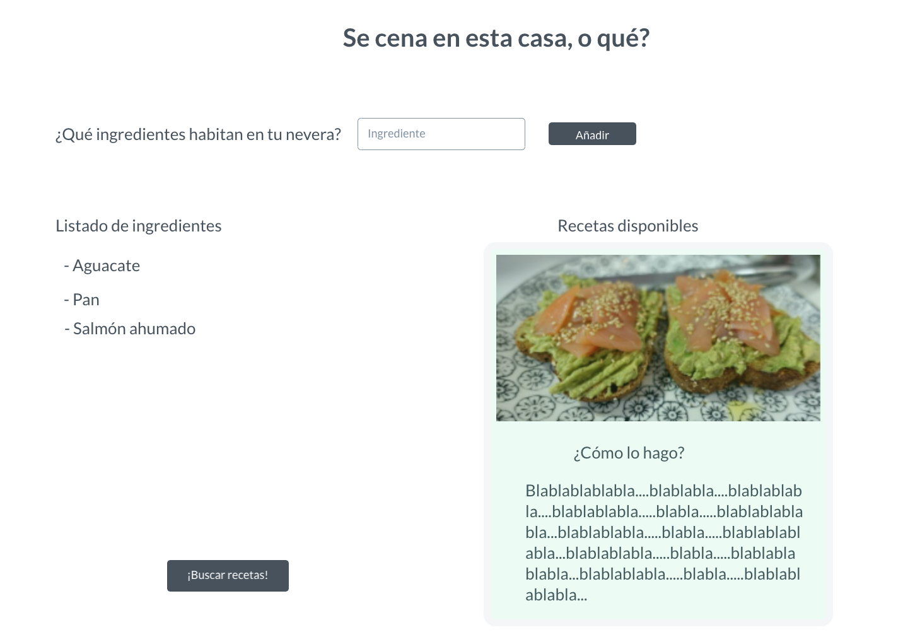

## Fase 1

### 1. Requisitos

#### Descripción

Para esta primera fase, tengo que tener una base de datos de recetas, que contengan las palabras de los ingredientes que la usuaria va a ir introduciendo en el input de mi página.
Esta base de datos puede ser:

- Una API ya existente, a la cual unicamente tengo que hacer llamadas para traerme los datos que necesito en cada búsqueda.
- Un JSON creado por mi misma en el que haya X número de recetas.

¿Qué quiero hacer con estos datos?

- En primer lugar, cuando la persona escriba la palabra del ingrediente esta deberá acumularse en un listado en la parte izquierda de la interfaz de usuario; de tal manera que a medida que se vayan introduciendo ingredientes, cada uno de ellos se irá mostrando en dicha lista.
- Una vez se hayan introducido todos los ingredientes, se deberá pulsar el botón de búsqueda correspondiente y nos traeremos los datos de la/s receta/s que corresponda.

#### Requisitos técnicos

Voy a necesitar:

- Un fetch para coger los datos (o bien de un servidor ya existente o uno fake)
- Manejo de React para poder pintar los inputs en el listado y posteriormente pintar las recetas.
- Un poco de maquetación.

### 2. Prototipo

### 3. Planificación

Tareas de la fase 1: https://github.com/Crismmgg/my-first-side-project/projects/1

### 4. Desarrolla

### 5. Feedback y valoración

Para saber si he cumplido mi objetivo voy a:

- Probar la aplicación con datos de entrada correctos.
- Probar la aplicación con datos de entrada incorrectos, como por ejemplo, ingredientes que no se encuentren en mi base de datos.
- Voy a enseñárselo a mis compañeras de Adalab y profesor para que "hagan el mono" y me digan qué opinan del proyecto.
